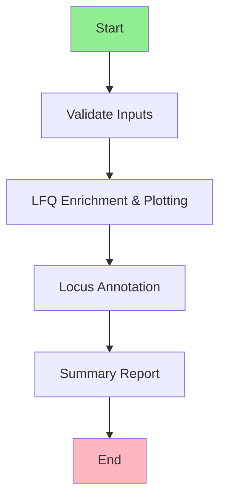

# bdb-qchipms

**Production-grade Snakemake pipeline for quantitative ChIP-MS (qChIP-MS) analysis**

This pipeline identifies and analyzes the local protein composition of genomic loci by integrating chromatin immunoprecipitation (ChIP) data with mass spectrometry proteomics data. It performs statistical enrichment analysis, generates publication-quality visualizations, and annotates proteins with genomic locus information.

## 📋 Table of Contents

- [Overview](#overview)
- [Features](#features)
- [Requirements](#requirements)
- [Installation](#installation)
- [Quick Start](#quick-start)
- [Configuration](#configuration)
- [Pipeline Workflow](#pipeline-workflow)
- [Directory Structure](#directory-structure)
- [Input Files](#input-files)
- [Output Files](#output-files)
- [Usage Examples](#usage-examples)
- [Troubleshooting](#troubleshooting)
- [License](#license)

## Overview

The bdb-qchipms pipeline processes quantitative mass spectrometry data from ChIP experiments to:

1. **Validate** input data integrity and configuration
2. **Perform LFQ (Label-Free Quantification) enrichment analysis** using statistical methods
3. **Generate volcano plots** for visualization of enriched proteins
4. **Annotate proteins** with genomic locus information using peak intersection
5. **Create summary HTML reports** with comprehensive analysis results

## Features

- ✅ **Automated Input Validation**: Ensures all required files and configurations are correct before processing
- ✅ **Statistical Enrichment Analysis**: R-based LFQ enrichment with multiple testing correction
- ✅ **Publication-Ready Visualizations**: Volcano plots highlighting significantly enriched proteins
- ✅ **Genomic Locus Annotation**: Intersects protein data with ChIP-seq peaks for locus-specific annotation
- ✅ **Comprehensive HTML Reports**: Summary reports with statistics, plots, and annotations
- ✅ **Resource Management**: Dynamic memory allocation with automatic retry on failure
- ✅ **Reproducible Environments**: Conda environments for Python and R dependencies
- ✅ **Container Support**: Docker containers for consistent execution across platforms

## Requirements

### System Requirements

- **Operating System**: Linux or macOS (Windows requires WSL)
- **Memory**: Minimum 8 GB RAM, recommended 16+ GB for large datasets
- **Storage**: ~5 GB free space for software and temporary files
- **CPU**: Multi-core processor recommended (pipeline supports parallelization)

### Software Dependencies

- **Snakemake** ≥ 7.0 (workflow management)
- **Conda/Mamba** (environment management)
- **Docker** (optional, for containerized execution)

### Biological Data Requirements

- **Protein intensity table**: TSV format with protein identifiers and LFQ intensities
- **ChIP-seq peaks**: BED format with genomic coordinates
- **Sample metadata**: TSV file with sample IDs, groups, and bait targets
- **Reference genomes**: Chromosome sizes file (e.g., hg38.chrom.sizes)
- **UniProt database**: FASTA file for protein identifier mapping (optional)

## Installation

### 1. Clone the Repository

```bash
git clone https://github.com/your-org/bdb-qchipms.git
cd bdb-qchipms
```

### 2. Install Snakemake

Using conda (recommended):
```bash
conda install -c bioconda -c conda-forge snakemake
```

Or using pip:
```bash
pip install snakemake
```

### 3. Verify Installation

```bash
snakemake --version
```

## Quick Start

### 1. Prepare Your Data

Place your input files in the `data/` directory:
- `protein_intensities.tsv` - Protein quantification data
- `macs2_peaks.bed` - ChIP-seq peak coordinates
- `references/hg38.chrom.sizes` - Chromosome sizes
- `references/uniprot_human.fasta` - UniProt database (optional)

Edit `config/samples.tsv` with your sample information.

### 2. Configure the Pipeline

Modify `config/config.yaml` to match your file paths and resource requirements.

### 3. Run a Dry-Run (Recommended)

```bash
snakemake -n
```

This shows what the pipeline will do without actually running it.

### 4. Execute the Pipeline

Local execution with 4 cores:
```bash
snakemake --cores 4 --use-conda
```

With container support:
```bash
snakemake --cores 4 --use-conda --use-singularity
```

## Configuration

### Main Configuration File: `config/config.yaml`

```yaml
# Global reference files
references:
  uniprot_db: "data/references/uniprot_human.fasta"
  chrom_sizes: "data/references/hg38.chrom.sizes"

# Input validation settings
validate_inputs:
  samples_tsv: "config/samples.tsv"
  protein_table: "data/protein_intensities.tsv"
  threads: 1

# LFQ enrichment analysis
lfq_enrichment:
  protein_table: "data/protein_intensities.tsv"
  enriched_tsv: "results/enrichment/qchip_ms_enriched_proteins.tsv"
  volcano_png: "results/plots/qchip_ms_volcano.png"
  threads: 4

# Locus annotation
locus_annotation:
  annotated_bed: "results/annotation/qchip_ms_locus_annotated.bed"
  threads: 2

# Summary report generation
summary_report:
  html_report: "results/reports/qchip_ms_summary.html"
  threads: 1

# Resource management
resources:
  base_mem_mb: 4000    # Starting memory allocation
  max_mem_mb: 32000    # Maximum memory limit
```

### Sample Metadata: `config/samples.tsv`

Tab-separated file with columns:
- `sample_id`: Unique sample identifier
- `group`: Experimental group (e.g., treatment, control)
- `bait_target`: Target protein for ChIP

Example:
```tsv
sample_id	group	bait_target
TRF2_ChIP_01	treatment	TERF2
TRF2_ChIP_02	treatment	TERF2
IgG_ChIP_01	control	IgG
```

## Pipeline Workflow



### Workflow Steps

1. **Input Validation** (`validate_inputs`)
   - Checks existence and format of all input files
   - Validates sample metadata consistency
   - Creates validation log

2. **LFQ Enrichment & Visualization** (`lfq_enrichment_and_plot`)
   - Performs statistical enrichment analysis
   - Calculates fold-changes and p-values
   - Generates volcano plot (PNG)
   - Outputs enriched protein table (TSV)

3. **Locus Annotation** (`locus_annotation`)
   - Intersects enriched proteins with ChIP-seq peaks
   - Annotates proteins with genomic coordinates
   - Outputs annotated BED file

4. **Summary Report** (`summary_report`)
   - Aggregates all results
   - Generates interactive HTML report
   - Includes statistics, plots, and tables

## Directory Structure

```
bdb-qchipms/
├── config/
│   ├── config.yaml          # Main pipeline configuration
│   └── samples.tsv          # Sample metadata
├── data/
│   ├── protein_intensities.tsv
│   ├── macs2_peaks.bed
│   └── references/
│       ├── hg38.chrom.sizes
│       └── uniprot_human.fasta
├── envs/
│   ├── python_env.yaml      # Python conda environment
│   └── r_env.yaml           # R conda environment
├── rules/
│   ├── validate_inputs.smk
│   ├── lfq_enrichment_and_plot.smk
│   ├── locus_annotation.smk
│   ├── summary_report.smk
│   └── scripts/
│       └── qchip_ms_enrichment.R
├── scripts/
│   ├── intersect_peaks.py
│   ├── summary_report.py
│   └── validate_config.py
├── Snakefile                # Main workflow definition
├── LICENSE
└── README.md
```

## Input Files

### Required Inputs

| File | Format | Description | Location |
|------|--------|-------------|----------|
| `protein_intensities.tsv` | TSV | Protein LFQ intensity matrix | `data/` |
| `macs2_peaks.bed` | BED | ChIP-seq peak coordinates | `data/` |
| `samples.tsv` | TSV | Sample metadata | `config/` |
| `hg38.chrom.sizes` | Text | Chromosome sizes | `data/references/` |

### Optional Inputs

| File | Format | Description |
|------|--------|-------------|
| `uniprot_human.fasta` | FASTA | UniProt protein database |

### Input File Formats

**Protein Intensities TSV:**
```tsv
ProteinID	TRF2_ChIP_01	TRF2_ChIP_02	IgG_ChIP_01	IgG_ChIP_02
P12345	1234567	1345678	234567	245678
P67890	567890	578901	123456	134567
```

**Peaks BED:**
```bed
chr1	10000	15000	peak_1	100	+
chr2	20000	25000	peak_2	150	-
```

## Output Files

All outputs are written to the `results/` directory:

| File | Format | Description |
|------|--------|-------------|
| `results/enrichment/qchip_ms_enriched_proteins.tsv` | TSV | Statistical enrichment results |
| `results/plots/qchip_ms_volcano.png` | PNG | Volcano plot visualization |
| `results/annotation/qchip_ms_locus_annotated.bed` | BED | Proteins annotated with genomic loci |
| `results/reports/qchip_ms_summary.html` | HTML | Comprehensive summary report |
| `results/logs/*.log` | Text | Execution logs for each rule |
| `results/benchmarks/*.txt` | Text | Performance benchmarks |

## Usage Examples

### Basic Execution

```bash
# Run with 4 cores using conda environments
snakemake --cores 4 --use-conda

# Run with verbose output
snakemake --cores 4 --use-conda --verbose
```

### Advanced Options

```bash
# Force re-run specific rule
snakemake -R lfq_enrichment_and_plot --cores 4 --use-conda

# Generate DAG visualization
snakemake --dag | dot -Tpng > dag.png

# Run in dry-run mode
snakemake -n --cores 4

# Use SLURM cluster (example)
snakemake --cluster "sbatch -p {cluster.partition} -t {cluster.time}" --jobs 100
```

### Cleanup and Restart

```bash
# Remove all generated files
snakemake --cleanup-metadata

# Unlock working directory if interrupted
snakemake --unlock
```

## Troubleshooting

### Common Issues

**1. Memory Errors**
- Increase `base_mem_mb` in `config/config.yaml`
- Reduce number of concurrent jobs
- Use `--latency-wait 60` for slow filesystems

**2. Conda Environment Issues**
```bash
# Clean conda cache
snakemake --conda-cleanup

# Rebuild environments
snakemake --use-conda --conda-create-envs-only
```

**3. Missing Input Files**
- Run validation step first: `snakemake results/logs/inputs_validated.done`
- Check file paths in `config/config.yaml`

**4. Container Errors**
```bash
# Pull container manually
docker pull rocker/tidyverse:4.3.2

# Or use Singularity instead
snakemake --use-singularity
```

### Logs and Debugging

- Check rule-specific logs in `results/logs/`
- Enable debug mode: `snakemake --debug`
- View benchmark data in `results/benchmarks/`

## Citation

If you use this pipeline in your research, please cite:

> [Add citation information here]

## Contributing

Contributions are welcome! Please:
1. Fork the repository
2. Create a feature branch
3. Submit a pull request

## License

This project is licensed under the terms specified in the [LICENSE](LICENSE) file.

## Support

For issues and questions:
- Open an issue on GitHub
- Contact: [add contact information]

---

**Built with Snakemake** | **Version 1.0** | **Last Updated: 2024**
